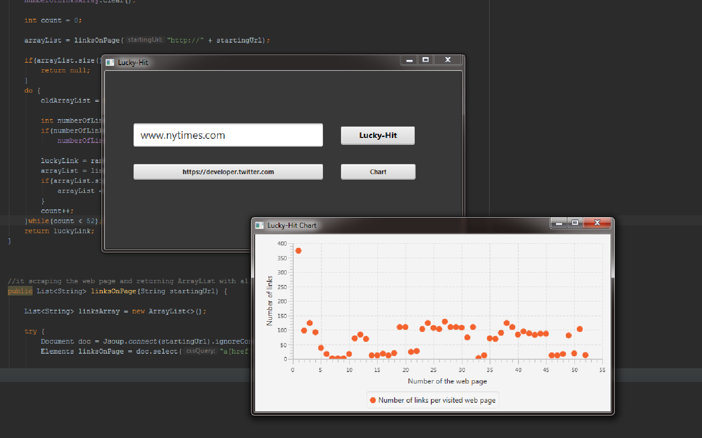

"Lucky Hit" is a program that will lead you to the darkest places of the Internet. After providing a starting URL, it will scrape the web page for all the links and randomly follow one until you reach an unknown place on the net. It is also providing charts with the number of all the links it scraped on the way. The code is written using JavaFX in two versions, with the use of FXML and without.

Code was written in Intelji 2017.  The executable file is in out/artifacts/LuckyHit_jar folder.

